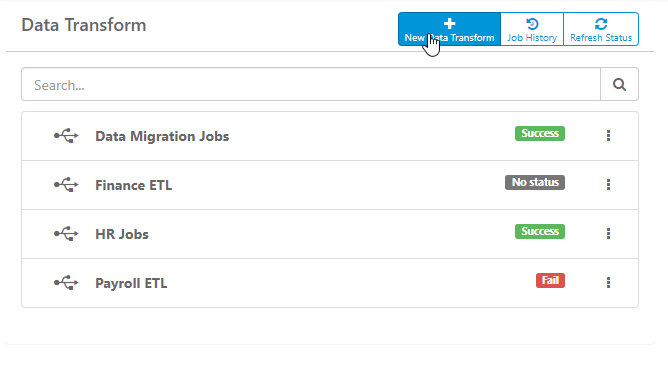
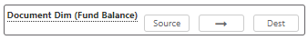
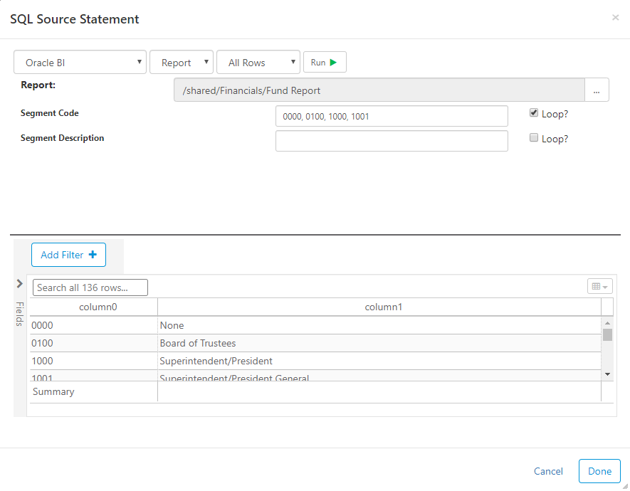
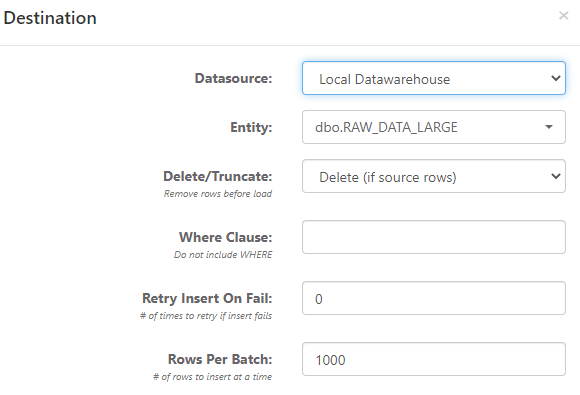
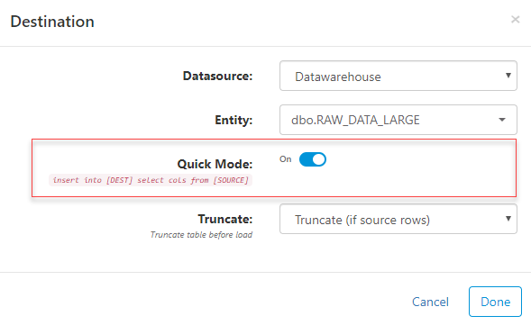
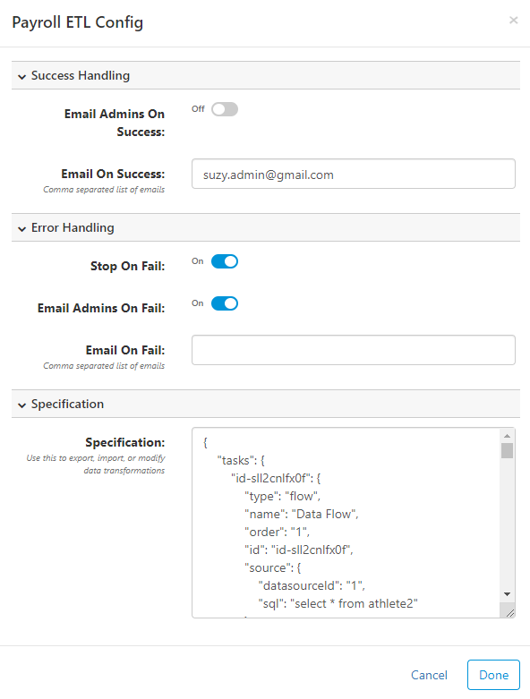
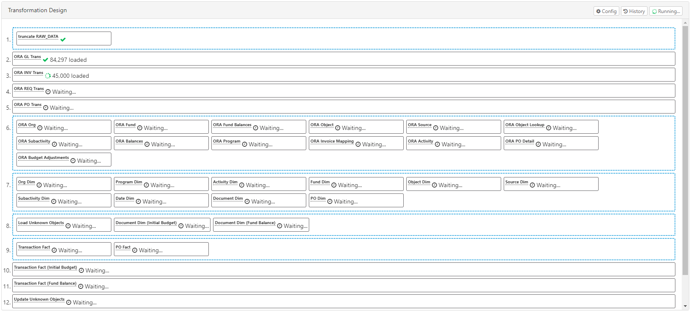

## Overview
The data transformation feature can be used to Extract, Transform, and Load (ETL) data from one place to another. Data flows make it easy to pull data from many different sources of data in order to cleanse, validate, transform, and integrate data into a wide array of databases. 

## Getting Started
From the **Administration > Data Transform** list, click on an existing transformation or **New Data Transform** at the top. This will bring you into the design process for a data transformation. Use the tools and design panel to create your transformation process.

## Tools
There are three (Container, SQL Task, Data Flow) simple tools you can use to design your transformation. Drag-and-drop any of the following tools from the **Tools** panel into the **Transformation Design** panel. The number order of the tasks will be the order that they are processed.

### Container
Containers can hold **SQL Tasks** or **Data Flows**. Everything inside a container will execute in parallel, or syncronously.

### SQL Task
Use SQL tasks to execute any SQL command. This is commonly used to set database settings or build custom insert/update/delete (CRUD) statements.

### Data Flow
Data flow tasks are used to extract data from a source and load it into a destination.

#### Name
To change the name/description to something unique, simply click the "Data Flow" text and enter a name.

#### Source
Data transform sources extract data from configured data sources ([show me how](administration#data-sources)). The drop-down list in the top-left shows existing data sources and also allows you to create a new data source by selecting **Add New**. The "# Rows" drop-down will limit the number of rows returned, allowing you to more efficiently test the SQL and set the columns. The limit is only applied for testing in this window, but does not apply when the transformation is ran later.

Click the **Run** button to test and verify your SQL and/or data results.

import Tabs from '@theme/Tabs';
import TabItem from '@theme/TabItem';

<Tabs
  defaultValue="db"
  values={[
    { label: 'Database', value: 'db', },
    { label: 'Oracle BI', value: 'oracle', },
  ]
}>
<TabItem value="db">

</TabItem>

<TabItem value="oracle">

Oracle BI (OBIEE) sources can be either a Logical SQL statement or Report. Logical SQL must follow the Oracle BI syntax. 

Report sources will pull the prompt values from Oracle BI, as shown below. Filter values in the source by entering them in the input next to the applicable prompt.
> **Tip** - if there is a limit to the number of rows a report can return, you can use the "Loop" feature. Clicking the loop checkbox sends multiple smaller requests for the data. The example above will send four separate requests to get the data for all four Segment Codes.

</TabItem>

</Tabs>

> **Important** - You must "Run" the source if you want to do column mapping

#### Column Mapping

Click on the arrow to map the source columns to destination columns.
> **Important** - if you do not map the columns, the natural order of the source and destination will be used.

Here are the main options for mapping:
* Order button: automatically map all the columns based on the order of the columns from the source
* Clear button: remove all existing mappings
* Convert: convert data type from source type into destination type
* Enter Value: manually enter a static value as a source column by setting the Source Column Name to "Enter Value"

#### Destination
Configuring the destination allows you to set the table that you would like to load source data into. Checking "Truncate" will execute the `TRUNCATE TABLE TABLENAME;` command, emptying the table rows, prior to loading data.

If the source and destination database are the same, then an additional "Quick Mode" option is available. This executes the `insert into [DEST] select cols from [SOURCE]` statement rather than chunking data, which is typically much faster.

## Configure (Settings)
While designing an ETL process, you can click on  in the top-right to open the configuration properties. There are three main areas:

1. Success Handling - configuration for what to do when the job runs successfully. *Email Admins on Success* will send an email to all FlexIt users in the *Admin* role. *Email on Success* allows you to enter comma separated email addresses that might differ from the admins. An SMTP email server must be configured ([show me](administration#smtp-email)).
2. Error Handling - similar to *Success Handling*, but also has an option for *Stop on Fail*. This stops the job immediately if any task fails. If this is not checked, individual task failures will still result in a successful job run.
3. Specification - this is the text specification for the current job. This can be used to import/export jobs, which is useful for backups or migrating a job from one environment to another. The specification is in JSON format.

## Run
There are a few ways to run ETL jobs and tasks. 

### Concurrent (Live)
You can run an individual Data Flow tasks by right-clicking on them in the design pane and selecting *Run*. The entire job can be run by clicking on the *Run* button in the top-right. Both of these will immediately run the tasks and stream results (i.e. rows loaded, task completed, etc.) to your browser, as shown here:

### Background

## History

## Schedule

## Clone (Backup)
Cloning a data tranformation is an easy way to copy the tranformation. This can be useful to save backups or create a new tranformation from an existing one. In order to clone, go to the list of all data tranformations, click on the ellipsis to the right of the transformation, and select `Clone`.
> **Tip** - there are a couple other ways to back up data transformations:
>
> 1. Copy the specification from the transformation [Configuration](#configure-settings) and save in a text file
> 2. Create a backup using the [Admin > Config > Backup and Restore](administration#backup-and-restore) feature

